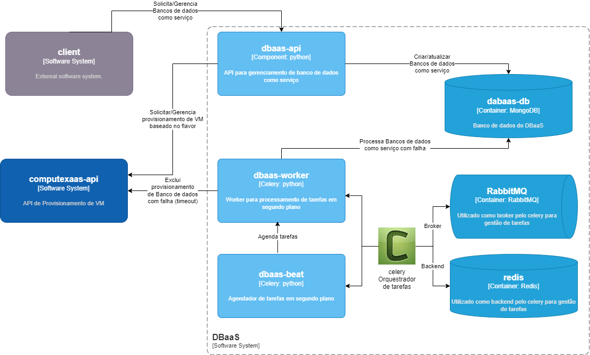
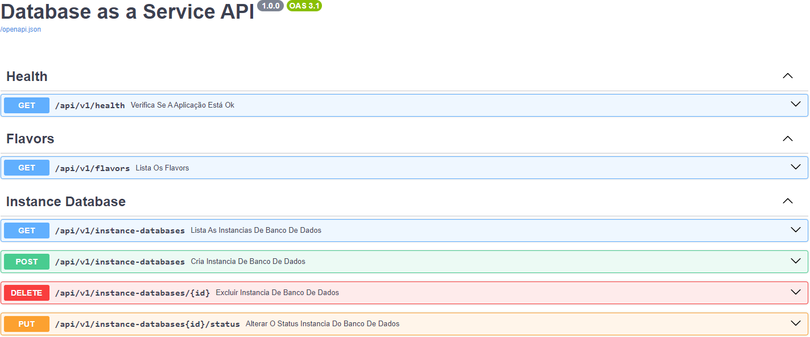
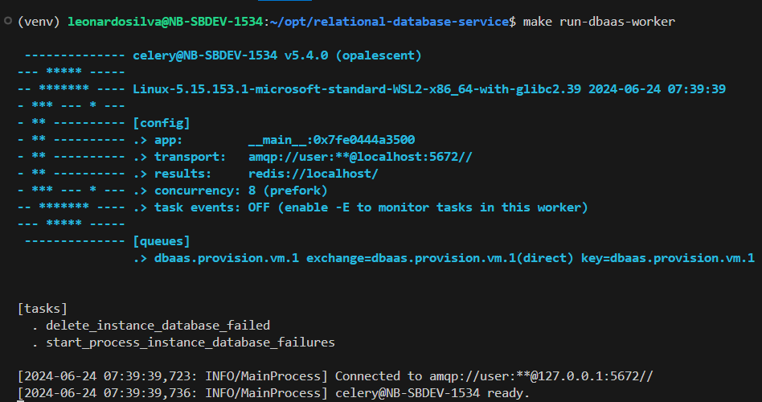
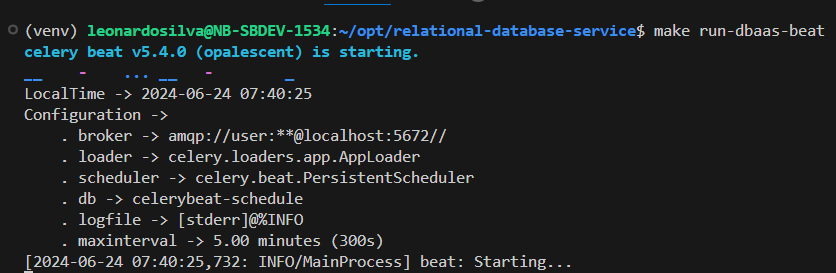
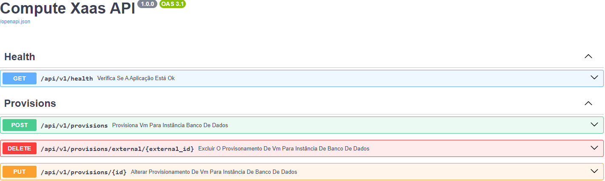
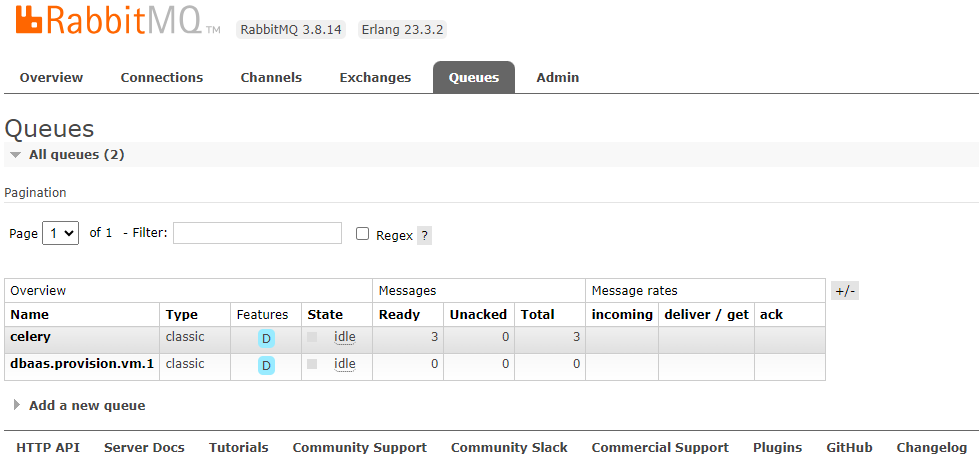

# Relational Database Service

Esse repositório tempos 2 projetos:
- DBaas
    - [API](#dbaas-api)
    - [Worker](#dbaas-worker)
    - [Beat](#dbaas-beat)

- Compute Xaas
    - [API](#computexaas-api)

## Estrutura do projeto


### Estrutura de pastas e arquivos
- .env: Arquivo de configuração de variáveis ​​de ambiente.
- .gitignore: Especifica arquivos e diretórios a serem ignorados pelo Git.
- .pre-commit-config.yaml: Configuração para ganchos de pré-confirmação.
- black.toml: Configuração para o formatador de código.
- computexaas_api/: API de provisionamento de VMs.
- conftest.py: Configuração para testes.
- dbaas/: API/Worker/Beat Gerenciador de banco de dados como serviço.
- devtools/: Ferramentas e scripts do desenvolvedor..
- docker-compose.yml: Configuração do Docker Compose para implantação em contêiner.
- flake8.ini: Configuração para o linter flake8.
Makefile: Comandos de construção e gerenciamento.
- migrations/: Scripts de migração de banco de dados.
- pytest.ini: Configuração para pytest.
- requirements.txt: Dependências do Python.
- static/: Static files (e.g., PNG, JPG, SVG).
- test/: Casos de teste e utilitários de teste.


## Pré-requisitos
Esse repositório requer o python na versão `3.12`

## Instalação
```shell
# Criação do ambiente virtual
make build-venv

# Ativação do ambiente virtual
source venv/bin/activate

# Instalar dependências
make install-dependencies

# Instalar git hooks
make install-git-hooks

# Criar/iniciar imagens docker
make docker-compose
```

## Migrações
```shell
# Executar migrações
make migrations
```

## Iniciar aplicações

Carregar variáveis de ambiente.
```shell
# Criar o arquivo .env na raiz do projeto
make load-dev-env
```

Iniciar apis e worker, cada aplicação deve ser iniciar em terminais separados, antes de iniciar cada aplicação ative o ambiente virtual `source venv/bin/activate`.
```shell
# Iniciar DBaaS API
make run-dbaas-api

# Iniciar DBaaS Worker
make run-dbaas-worker

# Iniciar DBaaS Beat
make run-dbaas-beat

# Iniciar Compute XaaS API
make run-computexaas-api
```

## Testes
```shell
make test
make coverage
```

# Database as a Service
## dbaas-api
- Swagger -> http://localhost:8000/api/swagger
- Documentação -> http://localhost:8000/api/docs



## dbaas-worker


## dbaas-beat


# Compute XaaS
## computexaas-api
- Swagger -> http://localhost:8001/api/swagger
- Documentação -> http://localhost:8001/api/docs



# RabbitMQ
- Dashboard -> http://localhost:15672/#/queues
- user -> user
- password -> password




